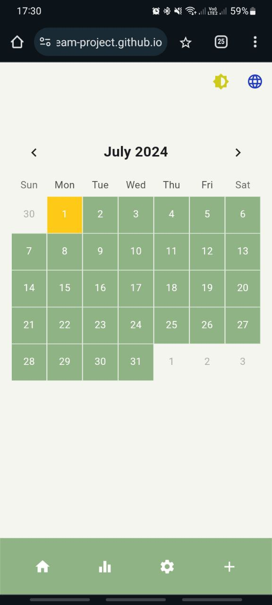
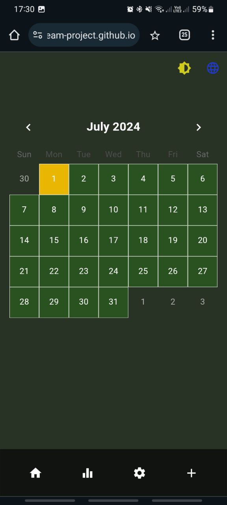
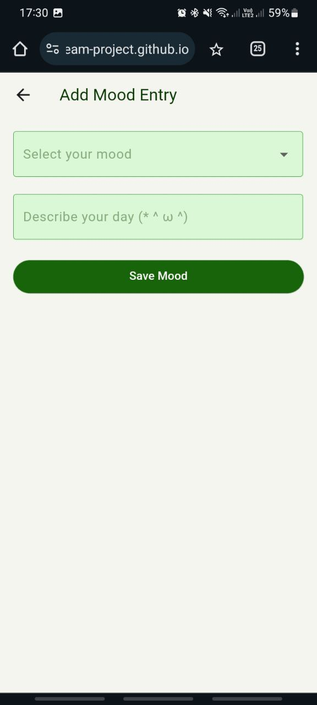

# Mood Tracker App

Mood Tracker is a Flutter application that helps users to record and monitor their moods daily. The app integrates with Firebase to store mood data and supports both light and dark themes.

## Features

- Record daily moods with optional text descriptions.
- View mood entries on a calendar.
- Toggle between light and dark themes.
- Firebase integration for storing and retrieving mood data.

## Screenshots

### Splash Screen GIF

### Home Screen

Home Screen. Light Theme

Home Screen. Dark Theme

### Mood Input Screen

First View on Mood Input Screen

Types of Mood

.jpg)

### Mood Input Screen Warnings

Data on this day is already exists

.jpg)

Mood is not selected

.jpg)

## Usage

### Recording a Mood
- Open the app. After 4 seconds of Splash Screen you will be transfered to the Home Screen.
- Select "plus" button in the bottom right corner.
- Select a mood and write a description.
- Select "Save Mood" button.

### Togling Themes
- Tap the theme toggle button (sun icon) on the app bar to switch between light and dark themes.

## Code Structure
- 'main.dart': Entry point of the application.
- 'provider.dart': Contains the business logic for handling mood data.
- 'screens' and 'additional_screens': Contains the UI screens of the application.
- 'dialogue/mood_dialogue.dart': Contains a dialog to show mood data in the calendar on the Home Screen.
- 'custom painter': Contains custom paint object for the Splash Screen. 
- 'connectivity': Contains the logic dealing with changes in connection with the Internet.

## Firebase Integration

The app uses Firebase Realtime Database to store mood entries.

## License

This project is licensed under the MIT License - see the LICENSE file for details.

## Contact

If you have any questions or suggestions, feel free to reach out to one of the team members at e.zagurskih@innopolis.university, o.novoselova@innopolis.university.
